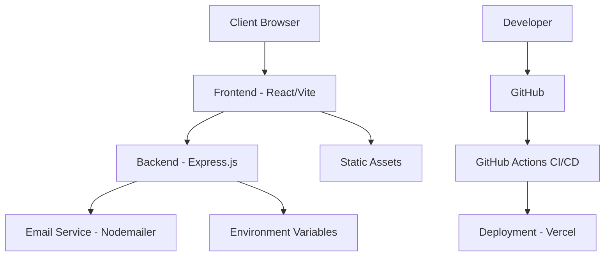

# Architecture Documentation

## System Overview

## Component Structure

### Frontend Architecture
- **Pages**: Route components (Home, Projects, Contact, etc.)
- **Components**: Reusable UI components (ContactForm, Navbar, etc.)
- **Hooks**: Custom React hooks (useScrollReveal, useRouteOptimization)
- **Utils**: Helper functions (cacheManager, performanceMonitor)
- **Context**: Global state management (ThemeContext)
- **Services**: Business logic (animationService, performanceService)
- **Stores**: State management (profileStore, projectsStore)
- **Data**: Static data definitions (projects, skills)

### Backend Architecture
- **API Routes**: RESTful endpoints (/api/contact, /api/health)
- **Middleware**: Security & validation (helmet, cors, rate limiting)
- **Services**: Business logic (email handling)
- **Utils**: Helper functions (environment validation)

## Data Flow

1. User interacts with frontend React components
2. Contact form data is validated on client-side
3. Data is sent to backend Express.js API endpoint
4. Backend validates and sanitizes data using express-validator
5. Backend sends email using Nodemailer
6. Backend responds with success/failure status
7. Frontend displays appropriate feedback to user

## Security Architecture

- **Input Validation**: Client and server-side validation using express-validator
- **Rate Limiting**: 5 requests per 15 minutes for contact form
- **CORS Protection**: Whitelisted origins only
- **Helmet.js**: Security headers and Content Security Policy
- **Environment Validation**: Required variables checked at startup
- **Email Security**: Secure transport configuration

## Performance Optimizations

- **Bundle Optimization**: Vite for fast builds and optimized bundles
- **Code Splitting**: Dynamic imports for route components
- **Caching**: Client-side caching strategies
- **Lazy Loading**: Components and routes loaded on demand
- **Image Optimization**: Properly sized and formatted images
- **Minification**: Automatic minification of CSS, JS, and HTML